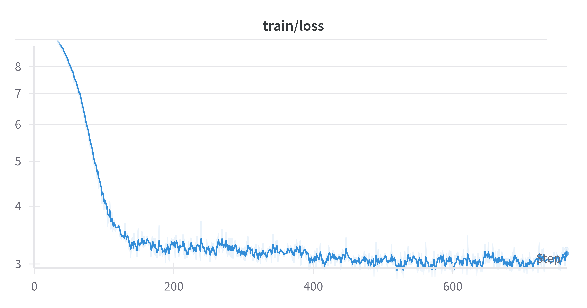
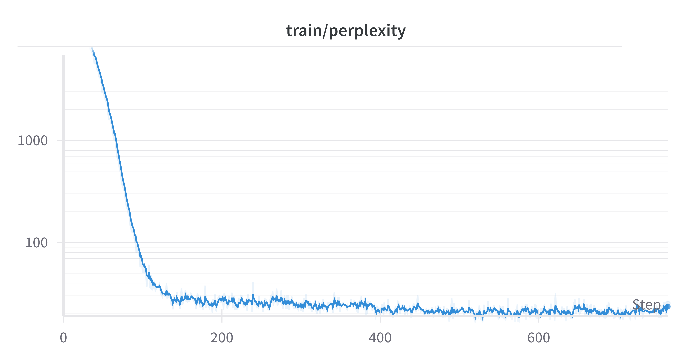

# Jax Transformer (wheel-jax)


## Why Wheel Jax?
Transformers are both alien robots and a model architecture (and other things too). Quite a few of the jax libraries use the "ax" sound in one form or another so I decided that a good name for this project would be some combination of something from "The Transformers" and  the "ax" sound. I tried a few ideas, "optimus-jax" which was hard to type out, "bumble jax" which wasn't a great name. Finally I found a character from "The Transformer" franchise that had the perfect name: "Wheeljack". WheelJax seemed like a natural fit.

## Installation

### Installing dependencies
Create a python virtual environment (for example using Conda)
```shell
conda create -n wheeljax python=3.10 -y
```

Install dependencies
```shell
pip install -e .
```

**[CUDA Optional]** Install jax and jaxlib CUDA wheels
#### CUDA12
```shell
pip install jax[cuda12_pip] -f https://storage.googleapis.com/jax-releases/jax_cuda_releases.html
```

#### CUDA11
```shell
pip install jax[cuda11_pip] -f https://storage.googleapis.com/jax-releases/jax_cuda_releases.html
```

## Training
**Note:** Some of this is still in progress and requires further testing, however favorable loss and perplexity trends do show through!

See the following example notebook. 
### GPT2-xxs
* [Notebook](https://github.com/djvaroli/jax-transformer/blob/main/notebooks/train_transformer_gpt2.ipynb)


